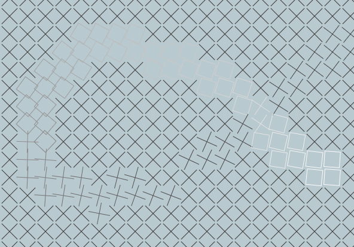

# Rotating Blocks

This project demonstrates an interactive display with rotating shapes using p5.js.

## Description

The project creates a grid of blocks and crosses on a canvas, where each shape rotates based on the distance from the mouse pointer. Shapes closer to the mouse pointer rotate faster than those further away. The size of each shape, the colors, and the rotation speed can be customized in the code.

## Usage

To view the project, open the `index.html` file in a web browser.

## Features

- Interactive display with rotating shapes
- Shapes change color and rotation speed based on distance from the mouse pointer
- Customizable shapes (rectangles and 'X' shapes)
- Customizable colors for shapes
- Customizable rotation speed

## Preview

## Credits

This project was created following a tutorial by [Patt Vira](https://www.pattvira.com/). The tutorial video can be found [here](https://youtu.be/Fratkco5ACw?si=e9dHp6tCyNA1DrdY).